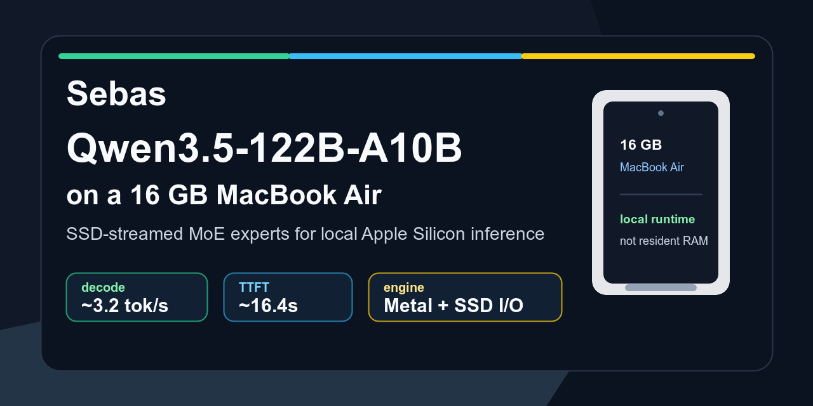

# Sebas

[English](README.md) | [日本語](README.ja.md) | [简体中文](README.zh-CN.md)

[](https://github.com/musshiyaki/sebas/releases/latest)
[](#install)
[](LICENSE)

Run Qwen3.5-122B-A10B locally on a 16 GB MacBook Air by streaming MoE expert
weights from SSD instead of trying to keep the whole model resident in memory.

Sebas has two layers. The core is an Apple Silicon inference engine for a
Qwen3.5 MoE model that does not fit a standard resident-model runtime. The
optional Rust CLI/agent layer makes that engine usable for local coding, search,
and experimentation.

## Install

Install the latest prebuilt Sebas CLI:

```bash
curl -fsSL https://raw.githubusercontent.com/musshiyaki/sebas/main/install.sh | sh
sebas --help
```

The installer copies `sebas` to `~/.local/bin` by default. See
[install.md](docs/install.md) for release tags, custom install paths, PATH
setup, and source-build fallback.

This installs the CLI only. The 122B path still needs a prepared model and the
external engine checkout described in [qwen122b-runbook.md](docs/qwen122b-runbook.md).

## Current Proof Point



Measured on a `MacBook Air (Apple M5, 16 GB)` with
`mlx-community/Qwen3.5-122B-A10B-4bit` after full local preparation. Latest
tracked run: [`benchmarks/qwen122b/2026-06-01-m5-air-16gb`](benchmarks/qwen122b/2026-06-01-m5-air-16gb/).

| Case | TTFT | Generation | Total |
|---|---:|---:|---:|
| Japanese short smoke | 12.97 s | 3.40 tok/s | 22.4 s |
| Japanese long benchmark | 16.08 s | 2.90 tok/s | 66.4 s |
| English short smoke | 14.70 s | 3.32 tok/s | 23.4 s |
| English long benchmark | 15.63 s | 2.86 tok/s | 69.4 s |
| Chinese short smoke | 12.82 s | 3.33 tok/s | 22.7 s |
| Chinese long benchmark | 17.62 s | 3.07 tok/s | 48.9 s |

The current bottleneck is expert weight movement from SSD, not Metal math
throughput. See [qwen122b-porting.md](docs/qwen122b-porting.md) for the
measured timing breakdown and architecture notes.

The first summary-only baseline lives in
[`benchmarks/qwen122b/2026-03-29-m5-air-16gb`](benchmarks/qwen122b/2026-03-29-m5-air-16gb/).
Use [`tools/collect-qwen122b-repro-pack`](tools/collect-qwen122b-repro-pack)
to collect raw logs, environment metadata, and doctor output for a new run.

## Why This Works

Qwen3.5-122B-A10B is a Mixture-of-Experts model. Only a subset of routed experts
is active for each token. Sebas prepares the model so dense weights can stay
small enough for the machine, while routed expert files are read on demand from
SSD.

The result is not "the whole 122B model fits in 16 GB RAM." It is a local
streaming runtime:

- Apple Silicon Metal compute for the active path
- SSD-backed routed expert streaming
- Qwen3.5 MoE shape-aware export and runtime config
- stable text-only inference path for 122B bring-up

## Why Not Ollama?

Sebas is not trying to replace Ollama as a general local model runner. Ollama is
excellent when a model fits a backend it supports, but this 122B bring-up is not
a standard "load a GGUF and run it" path.

The first working 122B path starts from MLX 4-bit safetensors and does not
require a GGUF overlay. It needs Qwen3.5 MoE-aware preparation before inference:

- derive architecture from `config.json` and safetensors shapes
- repack routed experts into per-layer files
- stream active expert blocks from SSD with `pread`
- drive custom C, Objective-C, and Metal kernels with that layout

That custom engine is the reason Sebas exists. The CLI/agent runtime is a
convenience layer around the engine, not the premise of the project.

## Source Checkout

The public entrypoint is the top-level `./sebas` command.

```bash
./sebas --help
```

Or build from source:

```bash
git clone https://github.com/musshiyaki/sebas.git
cd sebas
tools/install-sebas
sebas --help
```

## Local Engine Setup

For local engine commands, create a local workspace manifest first:

```bash
mkdir -p .workspace
cp .workspace.example/manifest.json .workspace/manifest.json
cp .workspace.example/system-no-think.md .workspace/system-no-think.md

./sebas engine doctor --engine qwen122b
./sebas engine bench --engine qwen122b
./sebas engine bench --engine qwen122b --lang all --case all --long-tokens 160
./sebas run engine-only --engine qwen122b
```

For a full 122B setup from the source MLX model, see
[qwen122b-runbook.md](docs/qwen122b-runbook.md). The current public umbrella
repo tracks the Sebas CLI and documentation. The Flash-MoE engine checkout is
kept outside the tracked tree until redistribution and upstream license terms
are fully clarified.

## What This Repository Contains

| Path | Purpose |
|---|---|
| `sebas` | Main CLI entrypoint for engine commands and optional agent workflow |
| `codex` | Compatibility alias that launches the same Rust runtime |
| `rust/` | Optional Sebas agent runtime, TUI, tool execution, config, sessions |
| `.workspace.example/` | Example local engine manifest; copy to `.workspace/` for local runs |
| `docs/qwen122b-runbook.md` | Public 122B setup and benchmark runbook |
| `docs/qwen122b-porting.md` | Public 122B architecture and measurement notes |
| `tools/` | Thin operational wrappers |
| `docs/` | Workspace architecture notes |
| `engines/` | External engine ownership and layout notes |

## Current Status

This is a research-grade local runtime, not a polished consumer app yet.

Working today:

- Qwen3.5-122B-A10B text-only inference path
- MacBook Air 16 GB bring-up with measured prefill/decode numbers
- `./sebas` CLI wrapper for local engine operation
- optional Rust code-first agent runtime and tool surface
- Qwen35B and Qwen122B engine selection paths
- benchmark and doctor commands

Still experimental:

- long-context latency
- fast mode / malloc-backed expert cache stability
- arbitrary MoE model support beyond the Qwen3.5 shape family
- vision tensors
- prebuilt releases and package-manager installers

## Optional Agent Runtime

Sebas also includes a Rust implementation of a code-first AI coding runtime.
This layer is optional for the 122B proof point. It is intended to make the
local Qwen engine usable from a developer workflow instead of remaining only an
inference demo.

```bash
cd rust
cargo build --release

./target/release/sebas
./target/release/sebas "explain the current diff"
```

See [rust/README.md](rust/README.md) for runtime details.

## Background

The inference work builds on Flash-MoE and the idea that very large MoE models
can run on small local machines when expert weights are streamed on demand. The
Anemll fork extends that direction for Apple Silicon and the 122B Qwen3.5 path.

Related docs:

- [Installing Sebas](docs/install.md)
- [Qwen3.5-122B porting notes](docs/qwen122b-porting.md)
- [Qwen3.5-122B runbook](docs/qwen122b-runbook.md)
- [Reproducibility pack workflow](docs/qwen122b-repro-pack.md)
- [Tracked benchmark summaries](benchmarks/qwen122b/)
- [Workspace architecture](docs/WORKSPACE_ARCHITECTURE.md)
- [Third-party notices](THIRD_PARTY_NOTICES.md)

## Limitations

- The 122B path is currently text-only.
- The first-token experience is still slow compared with small local models.
- Model preparation is large and technical.
- The runtime currently targets Qwen3.5 MoE family assumptions.
- Reproducibility depends on Apple Silicon hardware, local SSD behavior, and the
  prepared model layout.

Those limits are explicit because the interesting part of this project is the
engineering constraint: making a huge local model work on small hardware without
pretending it is magically lightweight.

## License

See [LICENSE](LICENSE) and [THIRD_PARTY_NOTICES.md](THIRD_PARTY_NOTICES.md).
